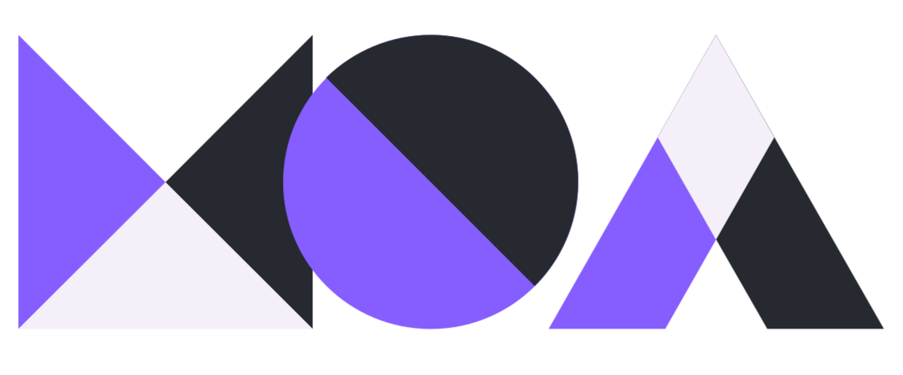

<div align="center">
  
</div>

<div align="center">


</div>

# MOA 🌐

MOA is a free, self-hosted metasearch engine designed to provide a dynamic search API service.


## 🔍 Key Features

- **Privacy First**  
  User information is neither stored nor tracked.

- **Metasearch (Multi-source Results)**  
  Based on searxng, it aggregates results from multiple search engines simultaneously.

- **Ad-free Experience**  

- **Open-source under GPL‑3.0 License**  
  Free to use, modify, and distribute under the terms of GPL‑3.0.

- **Easy to Self-host & Extendable**  
  Ready to run on your own server to serve as an API backend.


## 🚀 Quick Start

### Requirements
- Python 3.x
- Install the modules listed in `requirements.txt`

### Installation

Clone the repository:

```bash
git clone https://github.com/moa-engine/MOA
```

Navigate to the project directory:

```bash
cd MOA
```

Install dependencies:

```bash
pip install -r requirements.txt
```

Run the server:

```bash
uvicorn main:app
```

The server will be available at the address shown in the terminal output.  
API documentation is available at:

```
/docs
```

> Example: `http://localhost:8000/docs` (auto-generated by FastAPI)

Use `proxy_utils.py` to configure proxy settings.


## 🤝 Contributing

- Open an Issue to report bugs or suggest features
- Submit a Pull Request to improve or add new functionality
